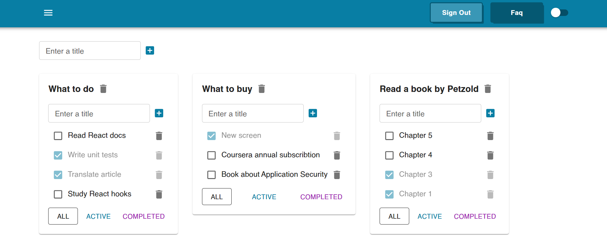

# Todo List

[English](README.md) | [Русский](README.ru.md)

Приложение на React и TypeScript с авторизацией, управлением списками и задачами, фильтрацией, переключением темы и интеграцией с REST API. RTK Query управляет серверными данными, а production-запросы к API проходят через серверный прокси на Vercel.

**[Live Demo](https://todo-list-swart-phi-73.vercel.app/#/login)**

## Демо-аккаунт

Для знакомства с приложением используйте публичный тестовый аккаунт:

- **Email:** `free@samuraijs.com`
- **Пароль:** `free`

## Превью



## Возможности

- Вход, восстановление авторизации при запуске, выход и защищённые маршруты.
- Создание, переименование и удаление списков и задач; редактирование названия по двойному клику.
- Переключение задач между выполненными и активными; фильтры All, Active и Completed.
- Переключение светлой и тёмной темы.
- Валидация формы входа и проверка непустого названия при создании элементов.
- Skeleton-компоненты, индикаторы загрузки и уведомления об ошибках API.

## Технологии

| Область | Технологии |
| --- | --- |
| Интерфейс | React, TypeScript, Material UI, Emotion, CSS Modules |
| Состояние и API | Redux Toolkit, RTK Query |
| Маршрутизация | React Router (`HashRouter`) |
| Формы | React Hook Form, Zod |
| Инструменты и тесты | Vite, pnpm, Vitest |
| Деплой | Vercel, Vercel Functions |

## Архитектура / API

```text
Разработка: React → Vite development proxy → SamuraiJS API
Production: React → Vercel server-side proxy → SamuraiJS API
```

RTK Query управляет запросами серверных данных, кешированием и инвалидацией после мутаций. Production-прокси в [api/proxy.js](api/proxy.js) предоставляет браузеру API по пути `/api/1.1/` на домене приложения, исключая прямые междоменные запросы к SamuraiJS.

## Локальный запуск

Требуются Node.js 22.12+ и pnpm.

```bash
git clone https://github.com/TheGognacLady/todo-list.git
cd todo-list
pnpm install
```

Создайте `.env.local` в корне проекта и укажите свой API-ключ SamuraiJS:

```dotenv
VITE_API_KEY=your_api_key_here
```

Запустите сервер разработки:

```bash
pnpm dev
```

Откройте [http://127.0.0.1:3000/#/login](http://127.0.0.1:3000/#/login).

Не добавляйте настоящие API-ключи и токены в коммиты. Файлы окружения исключены из Git, но значения `VITE_` попадают в браузерную сборку.

## Тестирование

Unit-тесты в [src/tests](src/tests) используют Vitest:

- `createTaskModel`: формирование модели обновления, сохранение остальных полей, значения zero/null, исключение серверных полей и отсутствие мутаций исходных данных.
- `handleError`: HTTP-ошибки, сетевые ошибки, таймауты, ошибки разбора ответа, бизнес-ошибки, отсутствие сообщений и неожиданные формы ответа.

Тесты используют подменённый dispatch и не требуют работающего API или учётных данных. Vitest использует существующую конфигурацию Vite, включая алиас импортов. Тесты покрывают утилиты, но не весь интерфейс и не сквозные сценарии авторизации.

```bash
pnpm test          # Режим наблюдения
pnpm test --run    # Однократный запуск
pnpm build        # Проверка TypeScript и production-сборка
```

## Деплой

Приложение размещено на Vercel. Перед сборкой задайте `VITE_API_KEY` в переменных окружения Vercel. Конфигурация деплоя и API-прокси находится в [vercel.json](vercel.json).

## Структура проекта

```text
api/                 # Прокси API для Vercel
src/
  app/               # Приложение, store, общая конфигурация API
  common/            # Общий UI, хуки, маршруты, тема, утилиты
  features/
    auth/            # Форма входа, валидация, API авторизации
    todolists/       # Списки, задачи, модели API и UI
  tests/             # Unit-тесты утилит
docs/                # Скриншот приложения
```

## Технические решения

- Типизированные модели API и данные мутаций с выводом типов из Zod-схем там, где они используются; валидация входа выполняется через Zod resolver.
- Инвалидация тегов RTK Query после мутаций и обновление кеша для локальных фильтров списков.
- Общая утилита `createTaskModel` формирует данные обновления задачи без изменения исходного объекта.
- Централизованная обработка ошибок API передаёт сообщения в общий snackbar; unit-тесты проверяют пограничные случаи ответов с ошибками.
- Серверный прокси позволяет отправлять production-запросы к API на домен приложения.

## О проекте

Проект первоначально создавался в рамках обучения frontend-разработке в IT-Incubator. Затем он был дополнительно доработан, дополнен unit-тестами и размещён на Vercel для использования в портфолио.
